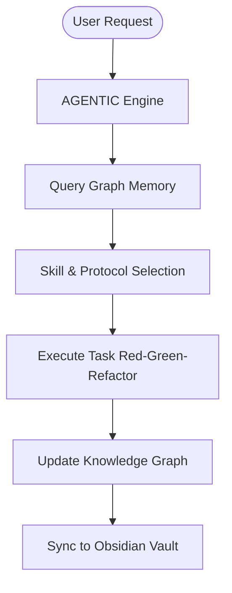

<p align="center">
  <h1 align="center">⚡ AGENTIC</h1>
  <p align="center"><strong>The Universal AI Agent Skill Engine & Cross-Agent Unified Memory Standard</strong></p>
  <p align="center">
    <em>1,000+ Production-Grade Skills & System Protocols for Antigravity, Claude Code, OpenCode, Codex, and Beyond.</em>
  </p>
</p>

<p align="center">
  <a href="#-quick-start"></a>
  <a href="LICENSE"></a>
  
  
</p>

---

## 🚀 Overview

**AGENTIC** transforms raw LLMs into autonomous, hyper-capable engineering squad members. Rather than writing long system prompts or suffering from token-depletion amnesia, **AGENTIC** equips your local AI coding harnesses with over **1,000+ battle-tested skills**, domain-specific tools, and a revolutionary **Graph-Based Cross-Agent Shared Memory**.

```text
  ┌────────────────────────────────────────────────────────────────────────┐
  │                           AGENTIC ECOSYSTEM                            │
  ├────────────────────────────────────────────────────────────────────────┤
  │ 🧠 UNIFIED GRAPH MEMORY  │  ⚡ 1,000+ SKILL VAULT  │ 🔮 OBSIDIAN SYNC │
  └──────────────────────────┴────────────────────────┴────────────────────┘
                                   │
      ┌────────────────────────────┼────────────────────────────┐
      ▼                            ▼                            ▼
  [Antigravity]              [Claude Code]                 [OpenCode]
 (Gemini 3.1 Pro)         (Claude 3.5 Sonnet)             (Local LLMs)
```

---

## 🔥 Key Features

### 1. 🌐 Token-Agnostic Handoff Protocol (TAHP) & Shared Memory
* **Zero-Amnesia Context**: Built on `graphify-memory`, AGENTIC writes project decisions, architectural trade-offs, and historical context into a unified `graph.json` knowledge graph.
* **Multi-Harness Baton Passing**: Switch seamlessly between **Antigravity (Gemini 3.1 Pro)**, **Claude Code (Sonnet 3.5)**, and **OpenCode**. When one model hits context limits, the next model picks up execution with 100% state continuity via `graphify query`.

### 2. ⚡ 1,000+ Specialized Skill Modules
Coverage across every modern engineering, scientific, and product domain:
* **Frontend & UX**: High-end visual design systems, micro-interactions, Tailwind, React/Next.js, SwiftUI liquid glass.
* **Backend & Systems**: Microservices, distributed tracing, database optimization (Postgres, Supabase, Neon), Rust, Go, Python, C++.
* **AI & Science**: Genomic query pipelines, PubMed/arXiv literature synthesis, PyTorch runtime debuggers, ML pipeline auditability.
* **Security & Auditing**: Red-team tactics, AgentShield config scanning, SQLi/XSS/CSRF hardening, automated dependency audits.

### 3. 🔮 Obsidian Vault Sync (`obsidian-vault-sync`)
* Automatically syncs agent implementation plans (`implementation_plan.md`), task trees, and decision logs into your local Obsidian Vault.
* Visualize the AI's internal reasoning, graph connections, and feature execution paths natively using Obsidian's Graph View.

---

## 📊 Comparison Matrix

| Feature | AGENTIC | Standard Prompting / Raw Harness | ECC |
| :--- | :---: | :---: | :---: |
| **Total Production Skills** | **1,000+** | 0 | ~280 |
| **Cross-Agent Shared Memory** | **Knowledge Graph (`graphify`)** | None | Flat Markdown |
| **Obsidian Visual Sync** | ✅ Native | ❌ | ❌ |
| **Multi-Harness Parity** | ✅ Antigravity, Claude, OpenCode | ❌ Model-locked | Limited |
| **Scientific & Domain Modules** | ✅ Deep (Bio, Chem, Finance) | ❌ | Dev-Only |

---

## 💻 Quick Start

### Windows (PowerShell)
```powershell
iwr -useb https://raw.githubusercontent.com/phoroth/AGENTIC/main/install.ps1 | iex
```

### macOS / Linux (Bash)
```bash
curl -fsSL https://raw.githubusercontent.com/phoroth/AGENTIC/main/install.sh | bash
```

---

## 🛠️ Multi-Agent Architecture



---

## 📄 License

This project is licensed under the **MIT License** - free for individuals, teams, and enterprise use.

---

<p align="center">
  <sub>Built with ❤️ for the future of Autonomous AI Systems.</sub>
</p>
