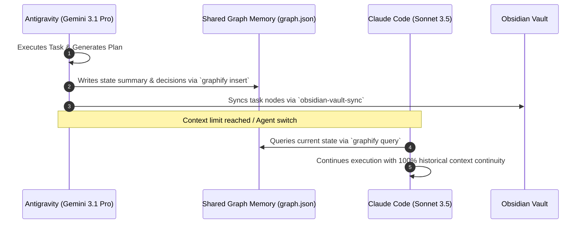

<p align="center">
  <h1 align="center">AGENTIC</h1>
  <p align="center"><strong>Universal AI Agent Operating System & 1,590+ Skill Vault</strong></p>
</p>

<p align="center">
  <a href="https://github.com/phoroth/AGENTIC/stargazers"></a>
  <a href="https://github.com/phoroth/AGENTIC/network/members"></a>
  <a href="LICENSE"></a>
  
  
  
  
</p>

<p align="center">
  
  
  
  
  
  
  
</p>

---

> **Optimize the context window. Persist state across model handoffs. Enforce enterprise engineering discipline.**

**AGENTIC** provides a complete autonomous AI engineering operating system. It equips your AI agents (**Gemini Antigravity**, **Claude Code**, **OpenCode**, **Codex**, **Cursor**, and **Zed**) with over **1,590+ specialized domain skills**, **67 subagent squads**, **5 plugin bundles**, continuous memory persistence (**Graphify v2**), test-driven development (TDD) gates, security scanners (**AgentShield**), and living architecture visualizers (**Obsidian Vault Sync**).

```text
plan ➔ test ➔ implement ➔ review ➔ verify ➔ graphify ➔ sync ➔ evolve
```

---

## 📚 Table of Contents

1. [💡 Why Choose AGENTIC?](#-why-choose-agentic)
2. [📦 What's Included](#-whats-included)
3. [🔌 Included Plugin Bundles](#-included-plugin-bundles)
4. [⚡ Quick Start & Installation](#-quick-start--installation)
5. [📖 Complete Guide & Daily Workflows](#-complete-guide--daily-workflows)
6. [🧠 Architecture: Token-Agnostic Handoff Protocol (TAHP)](#-architecture-token-agnostic-handoff-protocol-tahp)
7. [🛡️ Security, Governance & AgentShield](#%EF%B8%8F-security-governance--agentshield)
8. [🛠️ Cross-Harness Parity Matrix](#%EF%B8%8F-cross-harness-parity-matrix)
9. [📂 Repository Structure](#-repository-structure)
10. [🤝 Contributing & License](#-contributing--license)

---

## 💡 Why Choose AGENTIC?

| Challenge Without AGENTIC | Power With AGENTIC |
| :--- | :--- |
| **Context Amnesia**: Agents lose state when token limits are reached. | **Graphify Memory Engine**: Universal knowledge graph (`graph.json`) persists decisions and state across resets. |
| **Ad-Hoc Prompting**: Model forgets guidelines halfway through a task. | **1,590+ Domain Skills**: Enforces strict rules for Full-Stack, Bio, Chem, Finance, Security, and MLOps. |
| **Invisible Decisions**: Architecture choices disappear into long chats. | **Obsidian Vault Sync**: Auto-maps implementation plans & dependency trees visually into local Obsidian vaults. |
| **Single-Model Lock**: Stuck using one vendor's CLI harness. | **Universal Parity**: Works seamlessly across Antigravity, Claude Code, OpenCode, Codex, and Cursor. |
| **Unchecked Code**: Code generated without verification gates. | **Safety & Verification**: Built-in AST checks, linting, regression testing, and AgentShield security scanning. |

---

## 📦 What's Included

| Component | Count | Description |
| :--- | ---: | :--- |
| **Specialized Skills** | **1,590+ Skills** | TDD, security audits, database tuning, genomics, trading systems, UI design, performance engineering, cloud infrastructure, AI/ML pipelines |
| **Subagent Squads** | **67 Subagents** | Scoped workers for architectural planning (`planner`), code reviews (`code-reviewer`), build repair (`build-error-resolver`), database optimization (`database-reviewer`), etc. |
| **Plugin Bundles** | **5 Plugins** | Modular plugin bundles for Android CLI, Science tools, DevTools, Firebase, Web Guidance, and AGENTIC Core |
| **Shared Memory Engine** | **Graphify v2** | Knowledge graph engine enabling token-agnostic baton passing between LLMs |
| **Visual Architecture** | **Obsidian Vault** | Automated sync of implementation plans & task graphs to local Obsidian vaults |
| **Slash Commands** | **93 Commands** | Fast-path shortcuts (`/plan`, `/build-fix`, `/code-review`, `/security-scan`) |
| **Security Scanning** | **AgentShield** | Pre-commit security scanner auditing prompt surface, credentials, and tool permissions |

---

## 🔌 Included Plugin Bundles

| Plugin | Directory Path | Key Capabilities & Features |
| :--- | :--- | :--- |
| **AGENTIC Core** | `plugins/ecc` | 67 subagents, 277 core skills, 93 slash commands, TDD workflows, verification loops & code review gates |
| **Science & Biotech** | `plugins/science` | PubMed, ChEMBL, AlphaFold, ClinicalTrials, ENCODE, dbSNP, GTEx & UniProt database integrations |
| **Android CLI** | `plugins/android-cli-plugin` | Android project creation, deployment, SDK management, ADB UI testing & environment diagnostics |
| **Chrome DevTools** | `plugins/chrome-devtools-plugin` | Browser automation, visual testing, DOM inspection & devtools performance debugging |
| **Firebase Tools** | `plugins/firebase` | Firestore, Firebase Auth, Cloud Functions & hosting deployment workflows |
| **Modern Web Guidance** | `plugins/modern-web-guidance-plugin` | Next.js App Router, React 19, Tailwind v4, Vite, Web Vitals & performance optimization guidelines |

---

## ⚡ Quick Start & Installation

### Option 1: Universal One-Line Installer (Recommended)

Installs AGENTIC skills and plugins across all detected AI agent configuration paths on your machine (**Gemini Antigravity**, **Claude Code**, **OpenCode**, **Codex**, and **Cursor**).

#### Windows (PowerShell)
```powershell
iwr -useb https://raw.githubusercontent.com/phoroth/AGENTIC/main/install.ps1 | iex
```

#### macOS & Linux (Bash)
```bash
curl -fsSL https://raw.githubusercontent.com/phoroth/AGENTIC/main/install.sh | bash
```

---

### Option 2: Target Specific Agent Harness

Pass a harness name (`gemini`, `claude`, `opencode`, `codex`, `cursor`) to limit installation to a single harness:

```bash
# Bash
./install.sh claude
```

```powershell
# PowerShell
.\install.ps1 -Target cursor
```

---

## 📖 Complete Guide & Daily Workflows

### How AGENTIC Works
Once installed, your AI agent automatically loads matching skill definitions from `skills/` and `plugins/` whenever your task demands domain expertise.

### Common Engineering Workflows

| Task / Scenario | Command or Prompt | What AGENTIC Does |
| :--- | :--- | :--- |
| **Feature Planning** | `/plan "Add OAuth2 Auth"` | `planner` agent generates a structured blueprint, risk analysis, and task graph. |
| **Test-Driven Build** | `Use tdd-workflow` | Enforces the RED-GREEN-REFACTOR cycle with an 80%+ test coverage requirement. |
| **Code Review** | `/code-review` | `code-reviewer` agent performs fresh-context security and regression pass. |
| **Fix Broken Build** | `/build-fix` | `build-error-resolver` minimally repairs compiler and type errors without refactoring architecture. |
| **Query Memory** | `graphify query "auth rules"` | Retrieves past architectural decisions and invariants from `.agent/graphify-out/graph.json`. |
| **Obsidian Visualizer** | `obsidian-vault-sync` | Formats current `implementation_plan.md` into Obsidian graph nodes. |
| **Security Audit** | `/security-scan` | `security-reviewer` scans code for secrets, SSRF, SQLi, and OWASP Top 10 vulnerabilities. |

---

## 🧠 Architecture: Token-Agnostic Handoff Protocol (TAHP)

When working on complex, multi-day engineering projects, LLM context windows inevitably deplete. **AGENTIC** solves this with **TAHP**:



1. **State Persistence**: Before context resets or when handing off work, the active agent saves state and decisions to `.agent/graphify-out/graph.json`.
2. **Context Recovery**: The incoming agent queries the graph at startup to immediately acquire complete situational awareness.
3. **Zero Lost Work**: Architecture choices, attempted fixes, and invariants remain permanently indexed.

---

## 🛡️ Security, Governance & AgentShield

**AGENTIC** enforces strict security-by-default standards:
- **No Hardcoded Secrets**: Scans codebases using AgentShield before commits.
- **Sanitization Engine**: Guarantees zero leakage of private user data or internal project code during skill exports.
- **Input & SQL Validation**: Automated checks for OWASP Top 10 vulnerabilities.
- **Agent Guide**: AI agents reading the repo follow [`AGENTS.md`](AGENTS.md) for strict installation and tool execution protocol.

---

## 🛠️ Cross-Harness Parity Matrix

| Feature | Antigravity | Claude Code | OpenCode | Codex | Cursor |
| :--- | :---: | :---: | :---: | :---: | :---: |
| **1,590+ Skill Vault** | ✅ Full | ✅ Full | ✅ Full | ✅ Full | ✅ Full |
| **Graphify Shared Memory** | ✅ Native | ✅ Native | ✅ Native | ✅ Native | ✅ Native |
| **Obsidian Vault Sync** | ✅ Native | ✅ Native | ✅ Native | ✅ Native | ✅ Native |
| **Subagent Delegation** | ✅ 67 Squads | ✅ 67 Squads | ✅ 12 Squads | ✅ AGENTS.md | ✅ Scoped |
| **Automated Verification** | ✅ Hooks | ✅ Plugin Hooks | ✅ Plugin Events | ✅ Git Hooks | ✅ Custom Rules |

---

## 📂 Repository Structure

```text
AGENTIC/
├── skills/                 # 1,590+ domain-specific skills (code, bio, finance, design, security, cloud)
├── plugins/                # Modular plugin bundles (android-cli, science, devtools, firebase, web, ecc)
├── AGENTS.md               # AI agent installation & discovery guide
├── install.ps1             # Universal PowerShell installer script
├── install.sh              # Universal Bash installer script
└── README.md               # Repository documentation
```

---

## 🤝 Contributing & License

We welcome contributions! To add new skills, refine subagents, or improve harness sync scripts:
1. Fork the repository.
2. Create a feature branch (`git checkout -b feature/new-skill`).
3. Submit a Pull Request.

Distributed under the **MIT License**. See `LICENSE` for more information.

<p align="center">
  <sub>⭐ <strong>Star this repository</strong> if AGENTIC powers your AI workflow!</sub>
</p>
