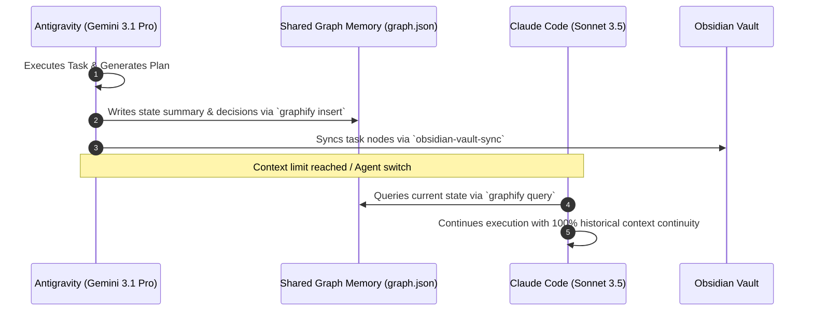

<p align="center">
  <h1 align="center">AGENTIC</h1>
  <p align="center"><strong>Universal AI Agent Operating System, 1,590+ Skill Vault & Subagent Orchestration Engine</strong></p>
</p>

<p align="center">
  <a href="https://github.com/phoroth/AGENTIC/stargazers"></a>
  <a href="https://github.com/phoroth/AGENTIC/network/members"></a>
  <a href="LICENSE"></a>
  
  
  
  
</p>

<p align="center">
  
  
  
  
  
  
  
  
</p>

---

> **Optimize the context window. Persist execution state across model handoffs. Enforce enterprise-grade software engineering discipline.**

**AGENTIC** is the universal agent harness operating system. It upgrades AI coding assistants (**Gemini Antigravity**, **Claude Code**, **OpenCode**, **Codex**, **Cursor**, and **Zed**) from standard snippet generators into autonomous engineering platforms. 

**AGENTIC** equips your agents with **1,590+ domain skills**, **67 specialized subagent squads**, **5 modular plugin bundles**, continuous memory persistence (**Graphify v2**), test-driven development (TDD) gates, security scanners (**AgentShield**), and living architecture maps (**Obsidian Vault Sync**).

```text
┌────────┐     ┌────────┐     ┌───────────┐     ┌────────┐     ┌────────┐     ┌──────────┐     ┌──────┐     ┌────────┐
│  Plan  │ ──► │  Test  │ ──► │ Implement │ ──► │ Review │ ──► │ Verify │ ──► │ Graphify │ ──► │ Sync │ ──► │ Evolve │
└────────┘     └────────┘     └───────────┘     └────────┘     └────────┘     └──────────┘     └──────┘     └────────┘
```

---

## 📚 Table of Contents

- [💡 Why Choose AGENTIC?](#-why-choose-agentic)
- [🏗️ The 8-Stage Engineering Lifecycle](#%EF%B8%8F-the-8-stage-engineering-lifecycle)
- [📦 System Composition & Core Components](#-system-composition--core-components)
- [🔌 Included Plugin Bundles](#-included-plugin-bundles)
- [🤖 Subagent Squads Directory](#-subagent-squads-directory)
- [⚡ Quick Start & Universal Installation](#-quick-start--universal-installation)
- [📖 Master Usage Guide & Prompts](#-master-usage-guide--prompts)
- [🎯 Daily Workflows & Cheat Sheet](#-daily-workflows--cheat-sheet)
- [🧠 Architecture: Token-Agnostic Handoff Protocol (TAHP)](#-architecture-token-agnostic-handoff-protocol-tahp)
- [📂 Categorized Skill Vault Index (1,590+ Skills)](#-categorized-skill-vault-index-1590-skills)
- [🛡️ Security, Governance & AgentShield](#%EF%B8%8F-security-governance--agentshield)
- [🛠️ Cross-Harness Parity Matrix](#%EF%B8%8F-cross-harness-parity-matrix)
- [📂 Repository Structure](#-repository-structure)
- [🤝 Contributing & License](#-contributing--license)

---

## 💡 Why Choose AGENTIC?

Standard AI coding assistants suffer from context degradation, forgotten architectural guidelines, and unchecked code outputs. **AGENTIC** solves these structural bottlenecks:

| Challenge Without AGENTIC | Enterprise Capability With AGENTIC |
| :--- | :--- |
| **Context Amnesia**: Agents lose state when token limits are reached. | **Graphify Memory Engine**: Universal knowledge graph (`graph.json`) persists decisions, architectural constraints, and state across model handoffs. |
| **Ad-Hoc Prompting**: Model forgets guidelines halfway through a task. | **1,590+ Domain Skills**: Enforces strict domain rules for Full-Stack, Bio, Chem, Finance, Security, and MLOps. |
| **Invisible Decisions**: Architecture choices disappear into long chat logs. | **Obsidian Vault Sync**: Auto-maps implementation plans & dependency trees visually into local Obsidian graph vaults. |
| **Single-Model Lock**: Locked into one vendor's CLI or desktop harness. | **Universal Parity**: Works seamlessly across Antigravity, Claude Code, OpenCode, Codex, Cursor, and Zed. |
| **Unchecked Code**: Code generated without validation or security gates. | **Safety & Verification**: Built-in AST checks, linting, regression testing, and AgentShield security scanning before shipping. |

---

## 🏗️ The 8-Stage Engineering Lifecycle

Every complex development task executed by an AGENTIC-enabled agent follows a deterministic 8-stage lifecycle:

1. **Plan (`planner`)**: Decomposes high-level requirements into structured blueprints, technical requirements, and risk assessments.
2. **Test (`tdd-workflow`)**: Enforces RED-GREEN-REFACTOR cycles by generating failing unit/integration tests before writing implementation code.
3. **Implement (`senior-fullstack`)**: Writes clean, functional code adhering to modern design patterns and language guidelines.
4. **Review (`code-reviewer`)**: Fresh-context subagent audits changes for security, performance, readability, and regression risks.
5. **Verify (`verification-loop`)**: Runs automated builds, test suites, and linter passes to gather empirical runtime proof.
6. **Graphify (`graphify-memory`)**: Serializes architectural decisions, modified entities, and dependencies into `.agent/graphify-out/graph.json`.
7. **Sync (`obsidian-markdown`)**: Formats implementation nodes and task graphs directly into local Obsidian vaults.
8. **Evolve (`continuous-learning-v2`)**: Extracts reusable instincts and lessons from session history to refine agent capabilities over time.

---

## 📦 System Composition & Core Components

| Component | Count | Description |
| :--- | ---: | :--- |
| **Specialized Skills** | **1,590+ Skills** | Domain-specific instructions for TDD, security audits, database tuning, genomics, trading systems, UI design, performance engineering, cloud infrastructure, AI/ML pipelines |
| **Subagent Squads** | **67 Subagents** | Scoped background workers for architectural planning (`planner`), code reviews (`code-reviewer`), build repair (`build-error-resolver`), database optimization (`database-reviewer`), etc. |
| **Plugin Bundles** | **5 Plugins** | Modular plugin bundles for Android CLI, Science tools, DevTools, Firebase, Web Guidance, and AGENTIC Core |
| **Shared Memory Engine** | **Graphify v2** | Knowledge graph engine enabling token-agnostic state persistence between LLMs |
| **Visual Architecture** | **Obsidian Vault** | Automated sync of implementation plans & task graphs to local Obsidian vaults |
| **Slash Commands** | **93 Commands** | Fast-path shortcuts (`/plan`, `/build-fix`, `/code-review`, `/security-scan`) |
| **Security Scanning** | **AgentShield** | Pre-commit security scanner auditing prompt surface, credentials, and tool permissions |

---

## 🔌 Included Plugin Bundles

**AGENTIC** includes 5 specialized plugin bundles stored in `plugins/`:

| Plugin Bundle | Directory Path | Core Capabilities & Integrated Tooling |
| :--- | :--- | :--- |
| **AGENTIC Core** | `plugins/ecc` | 67 subagents, 277 core skills, 93 slash commands, TDD workflows, verification loops & code review gates. |
| **Science & Biotech** | `plugins/science` | PubMed, ChEMBL, AlphaFold, ClinicalTrials, ENCODE, dbSNP, GTEx, Human Protein Atlas, UniProt, and JASPAR database integrations. |
| **Android CLI** | `plugins/android-cli-plugin` | Android project creation, Gradle builds, APK deployment, SDK management, ADB UI testing & environment diagnostics. |
| **Chrome DevTools** | `plugins/chrome-devtools-plugin` | Browser automation, visual testing, DOM inspection, network activity profiling & devtools performance debugging. |
| **Firebase Tools** | `plugins/firebase` | Firestore schema management, Firebase Auth, Cloud Functions deployment & hosting operations. |
| **Modern Web Guidance** | `plugins/modern-web-guidance-plugin` | Next.js App Router, React 19, Tailwind v4, Vite, Web Vitals & performance optimization guidelines. |

---

## 🤖 Subagent Squads Directory

AGENTIC features **67 specialized subagent profiles**. When faced with complex multi-step tasks, your primary agent delegates work to these dedicated subagents:

| Subagent Role | Purpose & Expertise |
| :--- | :--- |
| **`planner`** | Generates detailed technical specifications, dependency ordering, and step-by-step blueprints before touch code. |
| **`code-reviewer`** | Evaluates code for quality, maintainability, architectural fit, and potential bugs in a fresh sub-session context. |
| **`security-reviewer`** | Scans diffs and whole codebases for OWASP Top 10 vulnerabilities, leaked secrets, SQLi, and unsafe deserialization. |
| **`build-error-resolver`** | Surgically diagnoses compiler, bundler, and type errors to restore green build status without altering logic. |
| **`database-reviewer`** | PostgreSQL and cloud database specialist auditing migration safety, indexing strategies, and query performance. |
| **`a11y-architect`** | Audits frontend UI components for WCAG 2.2 Level AA accessibility compliance and ARIA attributes. |
| **`mle-reviewer`** | Machine learning engineering reviewer auditing data contracts, feature pipelines, training reproducibility, and model evaluation. |
| **`e2e-runner`** | Manages Playwright and browser journey tests, quarantining flaky tests and generating visual trace artifacts. |
| **`doc-updater`** | Keeps project documentation, README files, and codemaps in sync with modified codebases. |

---

## ⚡ Quick Start & Universal Installation

### Universal One-Line Installer

Installs AGENTIC skills and plugins across all detected AI agent configuration paths on your machine (**Gemini Antigravity**, **Claude Code**, **OpenCode**, **Codex**, and **Cursor**).

#### Windows (PowerShell)
```powershell
iwr -useb https://raw.githubusercontent.com/phoroth/AGENTIC/main/install.ps1 | iex
```

#### macOS & Linux (Bash)
```bash
curl -fsSL https://raw.githubusercontent.com/phoroth/AGENTIC/main/install.sh | bash
```

---

### Target Specific Harness (Optional)

Pass a harness parameter (`gemini`, `claude`, `opencode`, `codex`, `cursor`) to limit installation:

```bash
# Bash: Install only for Claude Code
./install.sh claude
```

```powershell
# PowerShell: Install only for Cursor
.\install.ps1 -Target cursor
```

---

## 📖 Master Usage Guide & Prompts

### 1. How Skills Auto-Trigger
Once installed, your AI agent automatically detects and loads matching skill instructions whenever a prompt aligns with the skill's triggers:
- Prompting *"Write a React hook for infinite scroll"* automatically loads `react-patterns` and `react-performance`.
- Prompting *"Search PubMed for target interaction data"* automatically loads `pubmed-database` and `opentargets-database`.

### 2. Explicit Skill Invocation
You can explicitly instruct your agent to follow a specific skill:
```text
Use the tdd-workflow skill to write tests before implementing the user authentication module.
```
```text
Use the security-reviewer skill to perform an OWASP audit on the current API endpoints.
```

### 3. Subagent Orchestration Prompt
You can delegate major tasks directly to specialized subagents:
```text
Delegate architectural planning to the planner subagent for adding multi-tenant workspace support.
```

---

## 🎯 Daily Workflows & Cheat Sheet

| Task / Objective | Workflow Command / Prompt | What AGENTIC Does |
| :--- | :--- | :--- |
| **Planning a Feature** | `/plan "Add WebAuthn Passkeys"` | `planner` agent generates structured implementation plan, risk matrix, and task breakdown. |
| **Test-Driven Feature Build**| `tdd-workflow` | Enforces RED-GREEN-REFACTOR cycle with an 80%+ test coverage requirement. |
| **Code Review & Audit** | `/code-review` | `code-reviewer` performs fresh-context security, performance, and regression pass. |
| **Fixing Broken Builds** | `/build-fix` | `build-error-resolver` minimally repairs compiler and type errors without refactoring. |
| **Querying Memory** | `graphify query "auth guidelines"` | Retrieves past architectural choices and invariants from `.agent/graphify-out/graph.json`. |
| **Obsidian Visualization** | `obsidian-vault-sync` | Formats current `implementation_plan.md` into a visual Obsidian graph node. |
| **Security Audit** | `/security-scan` | `security-reviewer` scans code for hardcoded secrets, SSRF, SQLi, and OWASP vulnerabilities. |

---

## 🧠 Architecture: Token-Agnostic Handoff Protocol (TAHP)

When executing large engineering projects, LLM context windows eventually exhaust. **AGENTIC** solves this with **TAHP**:



1. **State Persistence**: Before context resets or when switching models/agents, the active agent saves decisions and entities to `.agent/graphify-out/graph.json`.
2. **Context Recovery**: The incoming agent queries the graph at startup to immediately acquire complete situational awareness.
3. **Zero Lost Work**: Dead ends, attempted fixes, and invariants remain permanently indexed.

---

## 📂 Categorized Skill Vault Index (1,590+ Skills)

<details>
<summary><strong>📁 Software Engineering, Frameworks & Architecture</strong></summary>

- **Core Engineering**: `tdd-workflow`, `code-reviewer`, `architect-review`, `backend-patterns`, `react-patterns`, `nextjs-best-practices`, `dotnet-backend`, `golang-pro`, `rust-pro`, `c-pro`, `cpp-pro`, `python-patterns`, `haskell-pro`, `julia-pro`.
- **Frontend & UI**: `frontend-design`, `ui-setup`, `ui-pattern`, `ui-page`, `ui-tokens`, `ux-feedback`, `animejs-animation`, `magic-animator`, `remotion`, `rayden-code`.
- **Mobile**: `react-native-skills`, `flutter-expert`, `android-clean-architecture`, `expo-deployment`, `expo-api-routes`, `swiftui-ui-patterns`, `swiftui-performance-audit`.
</details>

<details>
<summary><strong>📁 Security, DevSecOps & Governance</strong></summary>

- **Security Auditing**: `security-auditor`, `differential-review`, `red-team-tactics`, `gdpr-data-handling`, `secrets-management`, `cred-omega`, `agent-shield`.
- **Testing & Fuzzing**: `ffuf-claude-skill`, `sql-injection-testing`, `xss-html-injection`, `web-security-testing`, `burp-suite-testing`.
</details>

<details>
<summary><strong>📁 Science, Life Sciences & AI/ML</strong></summary>

- **Biomedical & Genomics**: `astropy`, `alphafold-database-fetch-and-analyze`, `alphagenome-single-variant-analysis`, `chembl-database`, `clinical-trials-database`, `clinvar-database`, `dbsnp-database`, `embl-ebi-ols`, `encode-ccres-database`, `ensembl-database`, `gnomad-database`, `gtex-database`, `human-protein-atlas-database`, `interpro-database`, `jaspar-database`, `ncbi-sequence-fetch`, `openfda-database`, `opentargets-database`, `pdb-database`, `pubmed-database`, `uniprot-database`.
- **AI/ML & MLOps**: `machine-learning-ops-ml-pipeline`, `ml-pipeline-workflow`, `embedding-strategies`, `hugging-face-cli`, `hugging-face-gradio`, `hugging-face-jobs`, `transformers-js`, `pydantic-models-py`.
</details>

<details>
<summary><strong>📁 Cloud, Databases & DevOps</strong></summary>

- **Cloud Infrastructure**: `aws-skills`, `aws-cost-optimizer`, `aws-cost-cleanup`, `terraform-module-library`, `terraform-skill`, `gitops-workflow`, `istio-traffic-management`, `linkerd-patterns`.
- **Databases**: `database-admin`, `neon-postgres`, `postgres-patterns`, `drizzle-orm-expert`, `prisma-patterns`, `database-migrations-migration-observability`, `clickhouse-io`.
</details>

---

## 🛡️ Security, Governance & AgentShield

**AGENTIC** enforces strict security-by-default standards across every workflow:
- **No Hardcoded Secrets**: Scans codebases using AgentShield before commits.
- **Sanitization Engine**: Guarantees zero leakage of private user data or internal project code during skill exports.
- **Input & SQL Validation**: Automated checks for OWASP Top 10 vulnerabilities.
- **Agent Guide**: AI agents reading the repo follow [`AGENTS.md`](AGENTS.md) for strict installation and tool execution protocol.

---

## 🛠️ Cross-Harness Parity Matrix

| Feature | Antigravity | Claude Code | OpenCode | Codex | Cursor |
| :--- | :---: | :---: | :---: | :---: | :---: |
| **1,590+ Skill Vault** | ✅ Full | ✅ Full | ✅ Full | ✅ Full | ✅ Full |
| **Graphify Shared Memory** | ✅ Native | ✅ Native | ✅ Native | ✅ Native | ✅ Native |
| **Obsidian Vault Sync** | ✅ Native | ✅ Native | ✅ Native | ✅ Native | ✅ Native |
| **Subagent Delegation** | ✅ 67 Squads | ✅ 67 Squads | ✅ 12 Squads | ✅ AGENTS.md | ✅ Scoped |
| **Automated Verification** | ✅ Hooks | ✅ Plugin Hooks | ✅ Plugin Events | ✅ Git Hooks | ✅ Custom Rules |

---

## 📂 Repository Structure

```text
AGENTIC/
├── skills/                 # 1,590+ domain-specific skills (code, bio, finance, design, security, cloud)
├── plugins/                # Modular plugin bundles (android-cli, science, devtools, firebase, web, ecc)
├── AGENTS.md               # AI agent installation & discovery guide
├── install.ps1             # Universal PowerShell installer script
├── install.sh              # Universal Bash installer script
└── README.md               # Repository documentation
```

---

## 🤝 Contributing & License

We welcome contributions! To add new skills, refine subagents, or improve harness sync scripts:
1. Fork the repository.
2. Create a feature branch (`git checkout -b feature/new-skill`).
3. Submit a Pull Request targeting the `skills/` or `plugins/` directory.

Distributed under the **MIT License**. See `LICENSE` for more information.

<p align="center">
  <sub>⭐ <strong>Star this repository</strong> if AGENTIC powers your AI workflow!</sub>
</p>
