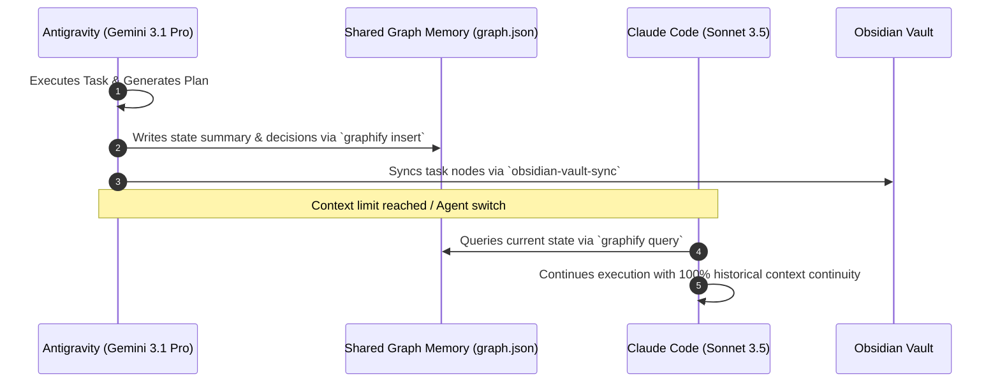

<p align="center">
  
</p>

<p align="center">
  <strong>Language:</strong>
  <a href="README.md">English</a> |
  <a href="docs/zh-CN/README.md">简体中文</a> |
  <a href="docs/es/README.md">Español</a> |
  <a href="docs/ja/README.md">日本語</a>
</p>

<p align="center">
  <a href="https://github.com/phoroth/AGENTIC/stargazers"></a>
  <a href="https://github.com/phoroth/AGENTIC/network/members"></a>
  <a href="LICENSE"></a>
  
  
</p>

<p align="center">
  
  
  
  
  
  
  
</p>

---

# AGENTIC

> **Optimize the context window. Persist everything else.**

Your AI agent can generate code snippets, but **AGENTIC** gives it an enterprise-grade autonomous engineering operating system: it plans before it builds, enforces test-driven development (TDD), runs cross-context code reviews, maintains a token-agnostic knowledge graph, and syncs living architecture maps into Obsidian.

```text
plan ➔ test ➔ implement ➔ review ➔ verify ➔ graphify ➔ sync ➔ evolve
```

Instead of rebuilding workflows in every prompt or losing state when context depletes, install **AGENTIC** once and give your agents persistent execution memory across **Gemini Antigravity**, **Claude Code**, **OpenCode**, **Codex**, **Cursor**, and **Zed**.

---

## 💡 Why Choose AGENTIC?

| Without AGENTIC | With AGENTIC |
| :--- | :--- |
| **Context Amnesia**: Agents lose state when token limits are reached. | **Graphify Memory**: Universal knowledge graph (`graph.json`) persists decisions across model handoffs. |
| **Ad-Hoc Prompting**: Model forgets guidelines halfway through a task. | **1,590+ Production Skills**: Enforces strict domain rules (Bio, Chem, Finance, Security, Full-Stack). |
| **Invisible Decisions**: Architecture choices disappear into long chats. | **Obsidian Vault Sync**: Auto-maps plans & dependency trees visually into Obsidian. |
| **Single-Model Lock**: Stuck using one vendor's CLI harness. | **Universal Parity**: Works seamlessly across Antigravity, Claude Code, OpenCode, and Codex. |
| **Unchecked Code**: Code generated without verification gates. | **Safety & Verification**: Built-in AST checks, linting, regression testing, and security scanning. |

---

## 📦 What's Included

| Component | Count | Description |
| :--- | ---: | :--- |
| **Specialized Skills** | **1,590+ Skills** | TDD, security audits, database tuning, genomics, trading systems, UI design, performance engineering |
| **Agent Squads** | **64 Subagents** | Scoped workers for architectural planning, code reviews, build repair, and refactoring |
| **Shared Memory Engine** | **Graphify v2** | Knowledge graph engine enabling token-agnostic baton passing between LLMs |
| **Visual Architecture** | **Obsidian Vault** | Automated sync of implementation plans & task graphs to local Obsidian vaults |
| **Slash Commands** | **84 Commands** | Fast-path shortcuts (`/ecc:plan`, `/build-fix`, `/code-review`, `/security-scan`) |
| **Security Scanning** | **AgentShield** | Pre-commit security scanner auditing prompt surface, credentials, and tool permissions |

---

## ⚡ Quick Start & Installation

### Option 1: Universal One-Line Installer (Recommended)

#### Windows (PowerShell)
```powershell
iwr -useb https://raw.githubusercontent.com/phoroth/AGENTIC/main/install.ps1 | iex
```

#### macOS & Linux (Bash)
```bash
curl -fsSL https://raw.githubusercontent.com/phoroth/AGENTIC/main/install.sh | bash
```

---

### Option 2: Harness-Specific Setup

#### 1. Gemini Antigravity
```bash
git clone https://github.com/phoroth/AGENTIC.git
cd AGENTIC
./install.sh --target antigravity --profile full
```

#### 2. Claude Code
```text
/plugin marketplace add https://github.com/phoroth/AGENTIC
/plugin install agentic@phoroth
```

#### 3. OpenCode & Codex
```bash
bash scripts/sync-agentic-to-codex.sh
```

---

## 🎯 Daily Workflows & Cheat Sheet

| What You Are Doing | Workflow / Command | What Agent / Skill Does |
| :--- | :--- | :--- |
| **Planning a New Feature** | `/ecc:plan "Add OAuth2 Auth"` | `planner` agent generates structured blueprint and risk assessment |
| **Test-Driven Feature Build** | `tdd-workflow` | Enforces RED-GREEN-REFACTOR cycle with 80%+ test coverage gate |
| **Code Review & Quality Check**| `/code-review` | `code-reviewer` performs fresh-context regression & security pass |
| **Fixing Broken Build** | `/build-fix` | `build-error-resolver` minimally repairs compiler & type errors |
| **Querying Project Memory** | `graphify query "auth rules"` | Retrieves past architectural choices & decisions from `graph.json` |
| **Visualizing System State** | `obsidian-vault-sync` | Formats current `implementation_plan.md` into an Obsidian graph node |
| **Auditing Security & Secrets** | `/security-scan` | `security-reviewer` audits inputs, secrets, and OWASP vulnerabilities |

---

## 🧠 Architecture: Token-Agnostic Handoff Protocol (TAHP)

When working on large projects, LLM context windows eventually deplete. **AGENTIC** solves this through **TAHP**:



1. **State Persistence**: Before context resets or when handing off work, the active agent saves decisions to `.agent/graphify-out/graph.json`.
2. **Context Recovery**: The incoming agent queries the graph at startup to immediately acquire complete situational awareness.
3. **No Lost Work**: Dead ends, attempted fixes, and architecture choices remain permanently indexed.

---

## 🛠️ Cross-Harness Parity Matrix

| Feature | Antigravity | Claude Code | OpenCode | Codex | Cursor |
| :--- | :---: | :---: | :---: | :---: | :---: |
| **1,590+ Skill Vault** | ✅ Full | ✅ Full | ✅ Full | ✅ Full | ✅ Full |
| **Graphify Shared Memory** | ✅ Native | ✅ Native | ✅ Native | ✅ Native | ✅ Native |
| **Obsidian Vault Sync** | ✅ Native | ✅ Native | ✅ Native | ✅ Native | ✅ Native |
| **Subagent Delegation** | ✅ 64 Squads | ✅ 64 Squads | ✅ 12 Squads | ✅ AGENTS.md | ✅ Scoped |
| **Automated Verification** | ✅ Hooks | ✅ Plugin Hooks | ✅ Plugin Events | ✅ Git Hooks | ✅ Custom Rules |

---

## 📂 Repository Structure

```text
AGENTIC/
├── .agent/                 # Global AGENTIC orchestration manifest & rules
├── .gemini/                # Antigravity harness adapters & skills
├── .claude-plugin/         # Claude Code marketplace manifest
├── .codex/                 # Codex reference roles and configs
├── .opencode/              # OpenCode plugin, rules, and commands
├── agents/                 # 64 specialized subagent profiles
├── AGENTS.md               # AI agent installation & discovery guide
├── skills/                 # 1,590+ domain-specific skills (code, bio, finance, design)
├── commands/               # 84 slash-command shims
├── graphify/               # Knowledge graph memory engine scripts
├── obsidian-vault/         # Obsidian sync adapters & templates
├── scripts/                # Multi-platform installer & sync utilities (Node/Bash/PS1)
├── tests/                  # Verification suite for skills & memory adapters
├── install.ps1             # One-click Windows installer
├── install.sh              # One-click Linux/macOS installer
└── README.md               # Repository documentation
```

---

## 🔒 Security & Governance

**AGENTIC** enforces strict security-by-default standards:
- **No Hardcoded Secrets**: Scans codebases using AgentShield before commits.
- **Sanitization Engine**: Guarantees zero leakage of private user data or internal project code during skill exports.
- **Input & SQL Validation**: Automated checks for OWASP Top 10 vulnerabilities.

To run a local security audit:
```bash
npx -y agent-shield scan --path .
```

---

## 🤝 Contributing

We welcome contributions! To add new skills, refine subagents, or improve harness sync scripts:
1. Fork the repository.
2. Create a feature branch (`git checkout -b feature/new-skill`).
3. Ensure test coverage passes (`node tests/run-all.js`).
4. Submit a Pull Request.

---

## 📜 License

Distributed under the **MIT License**. See `LICENSE` for more information.

<p align="center">
  <sub>⭐ <strong>Star this repository</strong> if AGENTIC powers your AI workflow!</sub>
</p>
